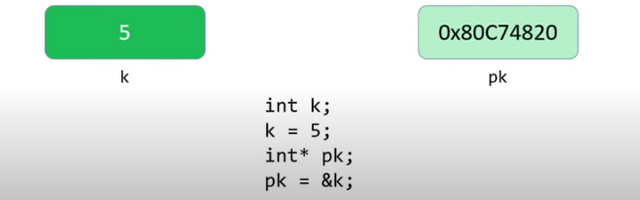
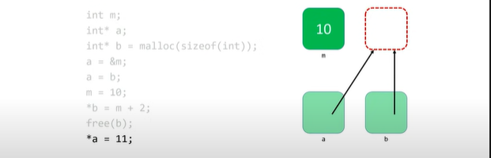

# Shorts: Hexadecimal

* aka **base-16**, is a much more concise way ro express the data on a computer´s system.

0, 1, 2, 3, 4, 5, 6, 7 ,8 ,9 a, b, c, d, e,f

* Also makes this mapping easy, because a group of four binary digits (bits) is able has 16 different-combinations, each of those combinations maps to a single hexadecimal digit

|Decimal|Binary|Hexadecimal|
|-------|------|-----------|
|0|0000|0x0|
|1|0001|0x1|
|2|0010|0x2|
|3|0011|0x3|
|4|0100|0x4|
|5|0101|0x5|
|6|0110|0x6|
|7|0111|0x7|
|8|1000|0x8|
|9|1001|0x9|
|10|1010|0xA|
|11|1011|0xB|
|12|1100|0xC|
|13|1101|0xD|
|14|1110|0xE|
|15|1111|0xF|

* For distinguish from other notations, hexadecimal uses the prefix *0x*

* binary has place values (1, 2, 4, 8...), and decimal does too (1, 10, 100, 1000...), hexadecimal as well, instead of being power 2 or 10, they´re powers of 16:

||16²|16¹|16⁰|
|----|---|----|---|
||256|16|1|
|*0x*|3|9|7|

* To convert a binary digit to headecimal, group four binary digits (bits) together, from right to left.
    * Pad the leftmost group with an extra 0 bits at the front if necessary.

* Then use the chart a few slides back or your memory to convert those bits to something a bit more concise:

01000110101000101011100100111101

* first group up, creating a break of 8 groups of 4.
0100 0110 1010 0010 1011 1001 0011 1101

0x46A2B93D

* Each group, uniquely corresponds to a hexadecimal digit

|s|u|m|places|
|-|-|-|-|
|8|4|2|1|
|1|1|0|1|
||||total13|

|s|u|m|places|
|-|-|-|-|
|8|4|2|1|
|0|0|1|1|
||||total3|


# Shorts: Pointers

* Pointers provide an alternative way to pass data between functions.
    * At this point, we have passed all the data **by value**(tehere´s one exception), which means that we only pass a copy of that data.

* If we use pointers instead, we pass the actual variable itself.
    * Means that a change that is made in ine function **can** impact what happens in a different function.

## Memory basics.

* Every file on you computer lives on your disk drive, be it a hard disk drive (HDD) or solid-state drive (SSD)

* Disk drives are just storage space; we can´t directly work there. Manipulation and use of data only take place in RAM, so we have to move data there. When turn off the computer all the data in RAM is destroyed.

* Memory is basically a huge array of 8-bit wide bytes.
    * 512mb, 1gb, 16gb...

|Data type|Size (in bytes)|
|---------|---------------|
|int|4|
|char|1|
|float|4|
|doble|8|
|long long|8|
|string/ char*|4 or 8 (32/64 bits system)|

* memory being a big array of bite-sized cells, useful for storage information, and to **random access**, to individual elements of the array by indicating which index location we want, each of that location has an **address**

* memory only works with binary storing values in chunks of memory *size* of the datatype

* string, or pointer *char** is 4 or 8 long depending on system based bits (32 or 64). Every address in memory is 32 or 64 bits long. (char*, int*, float*...)


### POINTERS ARE JUST ADDRESSES.
* They are addresses to locations in memory where variables live.


* All that happens here is pk gets the address of k

* now Pk gives us the information  we need to find k in memory. Having "arrow" pointing to where k is

* A **pointer**, then, is a data item whose
    * *value* is a memory address
    * *type* describes the data located at that memory address

* As such, pointers allow data structures and/ or vaiables to be shared among functions

* Makes computer enviroment more friendly since you work with the **original** chunks in memory

## NULL pointer
* This pointer points to nothing 

* When you create a pointer and don´t set its value immediately, you should **always** set the value pointer of NULL

* You can check whether or not a pointer is NULL using equality operator *(==)*

## &
* Another easy way to create a pointer is to simply **extract** the address of an already existing variable. Making use of the address extraction operator *(&)*

* If *x* is an int-type variable, then *&x* is a pointer-to-int whose value is the address of *x*

* if *arr* is an array of doubles, then *&arr[i]* is a pointer-to-double who value is the address of the *iᵗʰ* element of *arr*.
    * An array´s name is actually just a pointer to its first element.

## dereference *
* the main purpose of a pointer is to allow is to mmodify or inspect the location to which it points.
    * We go to the reference and we change the value there.

* if we have a pointer-to-char called *pc*, then **pc* is the data that lives at the memory address stored inside the variable *pc*  

* in this cotext * is knowkn as the **dereference** operator

* it "goes to the reference" and access the data at that memory location, allowing you to manipolate it at will.

## Dereferencing a NULL

it would create a **segmentation fault**

* its good since it defends our memory against accidental dangerous manipulation of unknown pointers.
    * That´s why is recommended to set your pointers to NULL if you aren´t setting them to a known desired value.

## Pointer Syntax
**int \*p;**
* The value of **p** is an address.
* We can dereference **p** using *
* If we find the location, find out an int

### Mutiple variable declaring
**int\* px, \*py, \*pz;**
* we need to add the sstar operator *, otherwise, py and pz would be only integers. 

## Conclusion
* modifying the *pk address by setting a new value will actually change the value of the variable in that address 
```c
int k;
k= 5;
int* pk; 
*pk = 35;
```

**now int k is 35**

* continue by
```c
int m;
m = 4;
pk = m;
```
**now pk points to m**

# shorts: Defining Custom Types 
* in c typedef is a way to create names for data types

```c
typedef <old name> <new name>;
typedef unsigned char byte;
```
* now we can use *byte* anywhere we want to use *unsigned char*

## typedef and structures
* structures have a 2 word typed name, so they are shorters
```c
struct car
{
    int year;
    char model[10];
    char plate[7];
    int odometer;
    double engine_size;
};
car_t;
//typedef struct car car_t;
```
* now instead of use *struct car*, we can now use *car_t*
```c
//variable declaration
//struct car mycar;
car_t mycar;

//field accesing
mycar.year = 2011;
strcpy(mycar.plate, "cs50");
mycar.odometer = 50505;
```

# Shorts: Dynamic Memory Allocation
<!-- (asignacion de memoria dinamica) -->

## All memory we´ve been working with has been coming from a pool of memory known as the **stack*

* What if we **don´t** know how much memory we´ll need at compile-time? 
<!-- like... get from malloc the size of a value we still dont know, datatype needed. -->

* We can use pointers to get access to a block of **dynamically-allocated memory** at runtime. The new memory comes from a pool of memory known as the **heap**.


```bash
     -------------------------
     |  |  |Machine code|  |  |
     -------------------------
     |  |  |  Globals   |  |  |
     -------------------------
     |  |  |   Heap     |  |  |
     -------------------------
     |           ↓   malloc   |
     -                        -
     |                        | 
     -                        -
     |           ↑            |
     -------------------------                   
     |  |  |  Stack  |  |  |  |
     -------------------------
```

* Happens that they share a big chunk on memory where distributes, **stack** grows up, **heap** grows down

## how to dynamically_allocate
* We get this dynamically-allocated memory by making call to the C standard library function *malloc()*, passing as its parameter the number of bites requested, after obtaining memory (if they can), *malloc()* will return a pointer to that memory.

* If *malloc()* **can´t** give you memory, it´ll handle back NULL.

* You can do this by dereferencing, if you do, also make sure you **check** for NULL, if it happens to appear, we need to abort your program or something to stop

```c
// statically obtain an integer
int x;

// Dynamically obtain an integer
int *px = malloc(sizeof(int));

```

* Malloc will try to find the size of the datatype we ask for, and it´ll return to you a pointer to that memory called px. We can manipulating its value by *dereferencing*

```c
// get an integer or declare
// int x = get_int(); 
int x = 6;

// array of floats on the stack
float stack_array[x];

// array of floats on the heap
float* heap_array = malloc(x * sizeof(float));
```

*(inside of the brackets we declare an array of that many floats on the stack)*

*heap_array* is my pointer to the memory that i´m getting, then *malloc* x times the size of a float, for example if i want to have 50 floats, I need 50 times the size of a float, (4 bytes)

## Trouble with using Dynamically-allocated memory

* Memory space is not automatically returned to the system for later use when the function in which it´s created finishes execution, if it occurs to happen, will result in a **memory leak** whick can compromise your system´s performance.

* For prevent this to happen, we must *free()* it
```c
// do stuff with word
char* word = malloc(50 * sizeof(char));

// now we´re done working with that block
free(word);

```

## Three golden rules: (best practices)

1. Every block of memory that you *malloc()* must subsequently be *free()*d.

1. Only memory that you *malloc()* should be *free()d.

1. Do not *free()* a block of memory more than once.
<!-- may het an invertedd memory leak, making the machine think that it has more memory than it actually do -->

## Conclusion
<br>


<br><br>
first declare *a* variable *m*,<br>
then a pointer **a*,<br>
and a pointer *b* that stores 4 bites with no values(NULL),<br>
then *a* pointer points to the adress of *&m* which gets *m* value inside.<br>
Now *a* value is the adress of *b*,<br>
*m* has the value of *10*,<br>
asign pointer **b* the value of *12*<br>
we free *b*;<br>
no we **cant** set a value for **a* since it was pointing to the same address than *b*, which have been freed.
  


# Shorts: Call Stacks

* When we call a function, the system sets aside space in memory for that function to do its necessary work.
    * We frequently call such chunks of memory **stack frames** or **function frames**.

* More than one function´s stack frame may exist in memory at a given time. If *main()* calls *move()*, which then calls *direction()*, all three functions have open frames.
<!-- we could call a function that calls functions, all 3 of them have open frames, but in general only one of those is running, even tho all of them have space set aside and are sort of hanging out, waiting to do something -->

* Frames are arranged and that´s what we call a **stack**. The frame for the most recently called function is always on the top of the stack.

* When a new function is called, a new frame is **pushed** onto the top of the stack and becomes the active frame.

* When a function finishes its work, its frame is **popped* off of the stack, and the frame immediately below it becomes the new, active, function on the top of the stack. This function picks ip immediately where it left off. 

# Shorts: File Pointers

## File usage

<!-- The real way to store data and the results of our programs -->
* The ability to read data from and write data to files is the primary means of storing **persistent data**, data that does not disappear when your program stops running.

* The abstraction of files that C provides is implemented in a data structure known as **FILE**
    * Almost universally when working with files, we will be using pointers to them, **FILE**

* File manipulation functions are included in **stdio.h**
    * All of them accept a *FILE** as one of their parameters, except for the function *fopen()*, which is used to get a file pointer in the first place.

## File manipulation functions
* Some of the most common file input/ output (|/O) functions that we´ll be working with, are:<br>
*fopen( )*<br> *fclose( )*<br> *fgetc( )*<br> *fputc( )*<br> *fread( )*<br> *fwrite( )*<br>

1. **fopen()**
    * Opens a file and returns a file pointer to it.
    * Always check the return value to make sure you dont get back NULL.

```c
FILE* ptr = fopen("file1.txt", "r");
```
<!-- ptr is a generic name for a file pointer -->

* **r** is the operation that we choose when we want to **read** a file. 
* **w** is the operation that we choose when we want to **write** a file.
* **a** is the operation that we choose when we want to **append** a file. 

*the difference between writing and appending, is that when you **write** a file, if you make a call to fopen for writing and that file already exists, is going to overwrite the entire file, deleting all the information that´s already there; whereas if you open it for **appending** it will go to the end of the file and then start writing from there, not losing any of the information you´ve done before.*

2. **fclose( )** 
    * Closes the file pointed to by the given file pointer
 ```c
 fclose(<file pointer>);
 fclose(ptr1);
 ```
    * Once its closed, we cant perform any more file I/O functions, you´ll have to re open it 

3. **fgetc( )**
*file get a character*
    * Reads and returns the next character from the file pointed to.
     * Note: The operation of the file pointer passed in as a parameter must be **r** for read, or you´ll suffer an error
```c
 char ch = fgetc(<file pointer>);
 char ch = fgetc(ptr1);
 ```
* The file pointer must´ve been opened for reading, not writing, since its one of the limmitations of **fopen**, if we want to read and write from the same file, then we need to open two separate file pointers to the same file, one for reading, one for writing.

4. **fputc( )**
    * Writes or appends the specified character to the pointed-to file.
    *The operation of the file pointer passed in as a parameter must be **w** for write or **a** for append, or we´ll suffer an error

 ```c
 fputc(<character>, <file pointer>);
 fputc('A', ptr2);
 ```

* **copying file to another using *fputc( )***

    ```c
    char ch;
    whie((ch = fgetc(ptr)) != EOF)
        fputc(ch, ptr2)
    ```

    * Is like duplicating using **cp** Linux command.
  


## Reading files
* The ability of get single characters from a file, if wrapped in a loop, mens we could **read** and print them to the screen.
```c
 char ch;
 while((ch = fgetc(ptr)) != EOF)
    printf("%c", ch);
 ```

***EOF** is a special value defined in **stdio.h** which is the end of file character.*
* Linux command **cat** essentially does this.

## Pointers to File pointers

* **fread( )**
    * Reads <qyt\> units of <size\> from the file pointed to and stores them in memory in a buffer (usually an array) pointed by <buffer\>
    *The operation file pointer passed in as a parameter must be **r** for read, or we´ll suffer an error*

```c
fread(<buffer>, <size>, <qyt>, <file pointer>);
```

*We can use this to read an arbitrary amount of information from a file, and store somewhere temporarily, instead of being able to just fit in a single variable, we might need to store it in an array.*

* We need a *pointer* to the location where we´re going to store information,how *large* each unit of information will be, how many *units* of information we want to acquire, and from *which file* we want to get them:

```c
int arr[10];
fread(arr, sizeof(int), 10, ptr);
```
*frecall is reading size of int times 10 bytes 10 of information from the file poined by ptr and storing those bytes in the array, which is capable of hold 10 four-byte units*

* Also we dont necessarily need to save our buffer on the stack, but in the **dynamic memory**, using malloc, saving it on the heap, not the stack. Not changing its buffer essence:
 
```c
double* arr2 = malloc(sizeof(double) * 80);
fread(arr2, sizeof(double), 80, ptr);
```
<!-- double is 8 bytes, 80 times 98 would be space of 640 bytes of information from the file pointed to by ptr and storing it bow in arr2 -->

* we can also use **fgetc( )** to get one character from the file, storing in a variable(we need to pass in the address of that variable cu of the first argument to fread is a pointer to the location of memory where we want to store in)

```c
char c;
fgetc(&c, sizeof(char), 1, ptr);
```

**fwrite( ) does exactly the same but to write instead of read**

```c
int arr[10];
fread(arr, sizeof(int), 10, ptr);
```
*here we are writing from arr and putting to the file, going from buffer to the file*

**heap fwrite( ) memory allocation:**

```c
double* arr2 = malloc(sizeof(double) * 80);
fread(arr2, sizeof(double), 80, ptr);
```

**one byte fwrite( ) passing in the address of that variable**

```c
char c;
fwrite(&c, sizeof(char), 1, ptr);
```

## Other File functions.
|Function|Description|
|--------|-----------|
|fgets( )|Reads a full string from a file.|
|fputs( )|Writes a full string to a file.|
|fprintf( )|Writes a formatted string to a file.|
|fseek( )|Allows you torewind or fast-foward within a file.|
|ftell( )|Tells you what (byte) position you are within a file.|
|feof( )|Tells you wheter you´ve read to the end of a file|
|ferror( )|Indicates wheter an error has occurred in working with a file.|