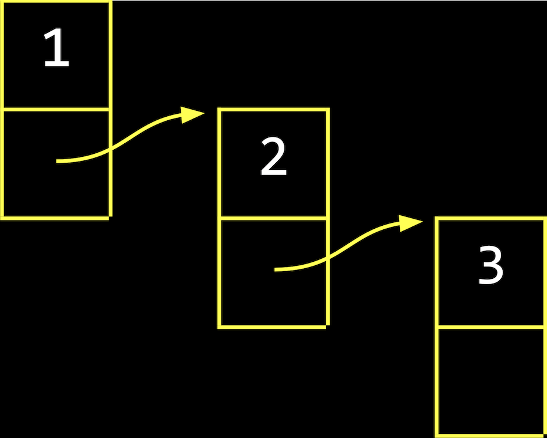
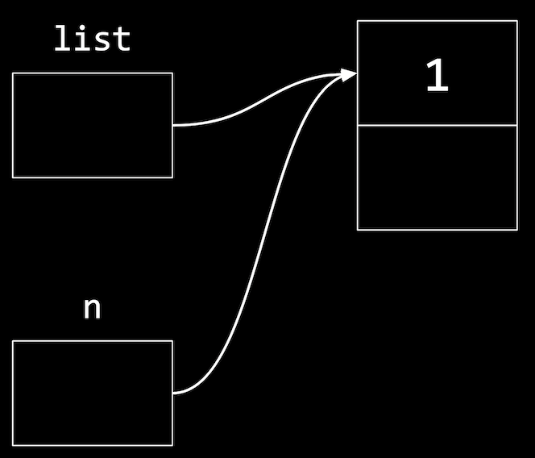
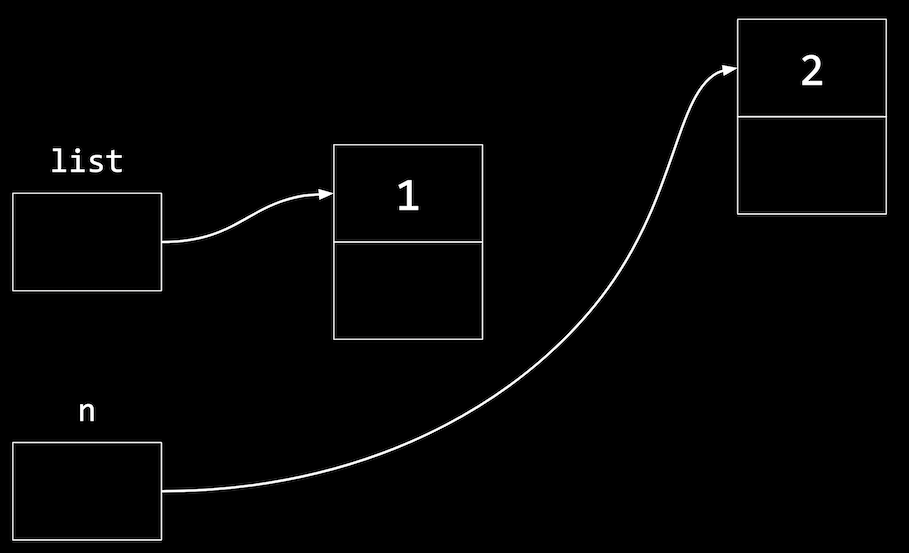
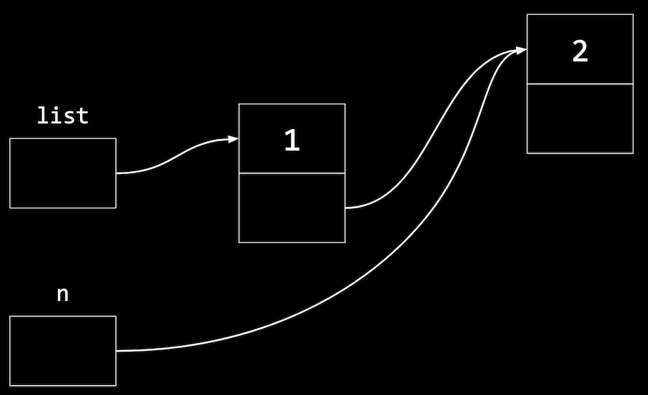
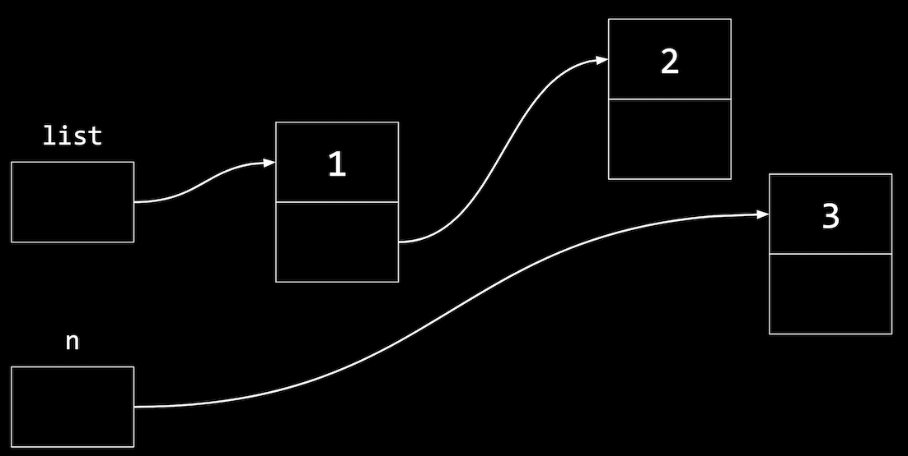
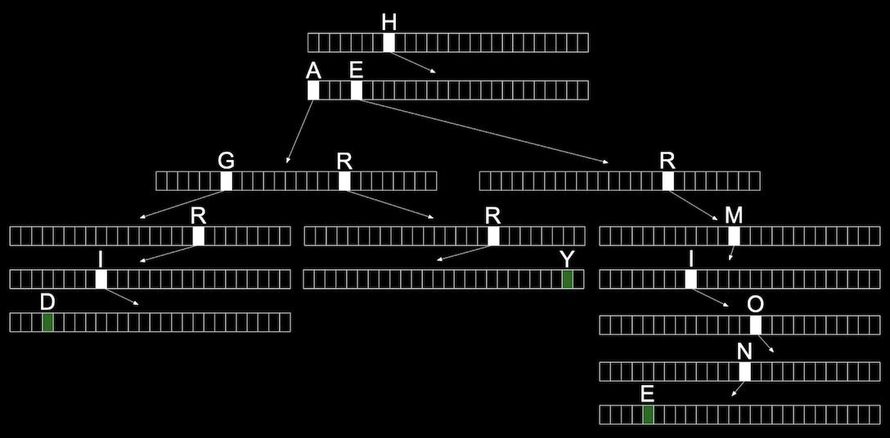

# WEEK 5 DATA STRUCTURES.

## Linked lists.

* Linked lists provides us a way of store a list of values in different parts of memory, since their addresses could be in totally random places, the values won´t be next to one another like in arrays. 

* When we insert values we allocate enough memory for both, the *value* we want to store, and the *address* of the **next** value. The first element store the value of the second and the last element storing *0x0* the null pointer.


- look at them as just pointers, since we dont need to know what the addresses actually are.

* With a linked list, we have the tradeoff needing to allocate mote memory for each value and pointer, in order to spend less time adding values. (When we copy an arraym we do need to allocate memory but we free the old array once we finish copying it.)

## Nodes.

* That group of boxes with a value and a pointer represent a **node**, a component of a data structure encapsulates some information. We can implement a node with a struct: 
```c
typedef struct node
{
    int number;
    struct node *next;
}
node;
```
- Starting this structs with *typedef struct node* so that we can refer to a *struct node* inside of our struct, inside is an *int* called *number*, for the value we want to store, and then a pointer to the next node with *struct node*. (We haven´t fully defined *node* yet, so  the compiler needs to know it´s a custom struct still.) to finally use just *node* in the rest of our program.

* The first part of building a linked list in code is by starting with our struct, using an empty list, so we can use the null pointer (as good practices, if we declare a list and we dont initialize it in that same second, is better to scure its value to be a pointer and not a *garbage value*).

* Now allocate some memory to add a node.
```c
node *n = malloc(sizeof(node));
```
- we make use of *sizeof* to get the size of both, a value and a pointer, and we´ll point to that with *n*, a pointer to *node*

* Now we can set a value of *number*(only if our pointer is not a NULL), instead of "(*n).number", as syntactic sugar we can write *n->number*, which has the same effect, also, setting a pointer to the *next* node to null.
```c
if(n != NULL)
{
    //(*n).number = 1;
    n->number = 1;
    n->next = NULL;
}

list = n;
```

* Finally we want our list pointer to have the same address as *n*, since *n* is a temporary variable and we want pur *list* variable to refer to it as the first node in our list.


## Growing arrays.

* Until now we have only seen arrays storing our data in stack memory, the next code shows how to have an array with memory from the heap with *malloc*

```c
#include <stdio.h>
#include <stdlib.h>

int main(void)
{
    // Dynamically allocate an array of size 3
    int *list = malloc(3 * sizeof(int));
    if (list == NULL)
    {
        return 1;
    }

    // Assign three numbers to that array
    list[0] = 1;
    list[1] = 2;
    list[2] = 3;

    // Time passes

    // Resize old array to be of size 4
    int *tmp = realloc(list, 4 * sizeof(int));
    if(tmp == NULL)
    {
        free(list);
        return 1;
    }

    // Add a fourth number to new array
    tmp[3] = 4;

    // Remember new array
    list = tmp;

    // Print new array
    for(int i = 0; i < 4; i++)
    {
        printf("%i\n", list[i]);
    }

    // Free new array
    free(list);
    return 0;
}
```

- First allocating enough memory for three integers and point to the first one with *int \*list* (if *malloc* is a pointer NULL the program exits with *return 1*.)
- In C arrays are equivalent to pointers, so we can use the same notation to set the values in our list using *list[0]* and so on. The compiler will perform the correct pointer arithmetic to set values at the right addresses.
- We can write *int \*tmp = realloc(list, 4 * sizeof(int));* so we dont need to allocate new memory and copying the old array to the new array, so *realloc* willl grow the original chunk for us if there´s enough free memory after it, by allocatin it to the same chunk. Otherwise, it will move the chunk of memory for us as well.

## Growing linked lists.

* When we have a large, large enough array, there might not be enough free memory contiguously, to store all of our values, we use a linked list, we can use smaller chunks of free memory for each node, stitching them together with pointers.

Add nodes by allocating more memory
```c
n = malloc(sizeof(node));
if(n != NULL)
{
    n -> number = 2;
    n -> next = null
}
```
- *n* is a temporary variable we use to point to this new node


* Now we need to update the pointer in our new *n*, since we want to maintain a sorted list:
```c
list -> next = n;
```
* This follows the pointer *list* and sets the *next* field to the same node as *n*, since its a pointer:

* To add a third node, we´ll allocate more memory again
```c
node *n = malloc(sizeof(node));
if(n != NULL)
{
    n -> number = 3;
    n -> next = NULL;
}
```
- Now *n* points a new node in memory


* To insert this node in our list, we´ll want to follow the *next* pointer in the first node that *list* points to (the node with value *1*), then setting the *next* pointer in that node (with value *2*) to point to the new node:
```c
node *n = malloc(sizeof(node));
if(n != NULL)
{
list ->next->next = n;
}
```
* In general, we´ll use a loop to move through our list, bit this will manually connect our nodes to look like:


* Even though we´re using more emory, and taking multiple steps to insert new nodes in this case (since we´re adding to the end of the list), we´re able to use small amounts of free space in memory, instead of having to look for a large chunk of contiguous memory.

## Implementing linked lists
```c
int main(void)
{
    // List of size 0
    node *list = NULL;
  
    // Add number to list
    node *n = malloc(sizeof(node));
    if (n == NULL)
    {
        return 1;
    }
    n->number = 1;
    n->next = NULL;

    // Update list to point to new node
    list = n;

    // Add a number to list
    n = malloc(sizeof(node));
    if (n == NULL)
    {
        free(list);
        return 1;
    }
    n->number = 2;
    n->next = NULL;
    list->next = n;

    // Add a number to list
    n = malloc(sizeof(node));
    if (n == NULL)
    {
        free(list->next);
        free(list);
        return 1;
    }
    n->number = 3;
    n->next = NULL;
    list->next->next = n;

    // Print numbers
    for (node *tmp = list; tmp != NULL; tmp = tmp->next)
    {
        printf("%i\n", tmp->number);
    }

    // Free list
    while (list != NULL)
    {
        node *tmp = list->next;
        free(list);
        list = tmp;
    }
    return 0;
}
```
- We need to free *list -> next*, the second node, and then *list*, the first node, since we need to follow it to the second node first, and follow the *next* pointer in the first node, and set the *next* pointer in that **node** to point the new node *n*

- We use a temporary pointer *temp*, to follow each of our nodes. We initaializa it to *list* with *node \*tmp = lsit*, which let us point to the first node in our list. Since within our loop is printing *tmp->number*, after each iteration of the loop, we´ll update *tmp* to *tmp->next*, which is the pointer to the next node.

- Finally, the loop will continue while *tmp != NULL*. In other words, our loop will end when *tmp*  is null, meaning that the current node isn´t pointing to another node. Since *tmp* is a pointer that we didn´t allocate additional memory for, **we don´t need to free it**.

- To free our list we use another *tmp* pointer to remember the next node **before** we free the current node. Then, *free(list)* will free the memory for the node that *list* points to. Then we can set *list* to *tmp*, the next node. Our loop will repeat until *list* is null. (With a linked list, we´re responsible fof freeing the memory for each node separately, since we allocated it separately as well).


- The code for this would be:
```c
n->next = list;
list = n;
```
- Similarly, to insert a node in the middle of our list, we change the *next* pointer of the new node first to point to the rest of the list, then upddate the previous node to point to the new node.

* The **running time** is *O(n)*for search, since we need to follow each node, one at a time. We wont be able to use binary search, since we cant calculate whera all of our nodes are. Inserting a node into a soerted list will have running time of *O(n)* as well, since we might need to insert our node at the end. But if we didn´t want to maintain a sorted list, the running time will be *O(1)*, since we can insert at tge beggining with just one step.

* The best case **running times** for insert and search, both have *Ω(1)*, since we might get lucjy and find our value immediately or be able to insert at the beggining of our list, for even a sorted list.

## TREES

* Is a data structure where each node points to other nodes. We might have a tree where each node points to one to the left(with a smaller value) and one to the right (with a larger value)


*  This structure allows us to use a **binary search**

* Each node has at most two *children* or nodes it is pointing to.

* And just as a linked list, we´ll want to keep the pointer at the beginning of our list, but in this case to the *root* or topmost node of the tree.

* To search a number we´ll start at the root node, and be able to recursively search the left or right subtree.

```c
#include <stdio.h>
#include <stdlib.h>

// Represents a node
typedef struct node
{
    int number;
    struct node *left;
    struct node *right;
}
node;

void free_tree(node *root);
void print_tree(node *root);

int main(void)
{
    // Tree of size 0
    node *tree = NULL;

    // Add number to list
    node *n = malloc(sizeof(node));
    if (n == NULL)
    {
        return 1;
    }
    n->number = 2;
    n->left = NULL;
    n->right = NULL;
    tree = n;

    // Add number to list
    n = malloc(sizeof(node));
    if (n == NULL)
    {
        free_tree(tree);
        return 1;
    }
    n->number = 1;
    n->left = NULL;
    n->right = NULL;
    tree->left = n;

    // Add number to list
    n = malloc(sizeof(node));
    if (n == NULL)
    {
        free_tree(tree);
        return 1;
    }
    n->number = 3;
    n->left = NULL;
    n->right = NULL;
    tree->right = n;

    // Print tree
    print_tree(tree);

    // Free tree
    free_tree(tree);
    return 0;
}

void free_tree(node *root)
{
    if (root == NULL)
    {
        return;
    }
    free_tree(root->left);
    free_tree(root->right);
    free(root);
}

void print_tree(node *root)
{
    if (root == NULL)
    {
        return;
    }
    print_tree(root->left);
    printf("%i\n", root->number);
    print_tree(root->right);
}
```
- The first step we have a tree with no nodes. Then we allocate memory for a node *n*, and set its value and pointers to children nodes to null. Then we can set our *tree* to point to that node. 

- To add a node, we allocate memory for another node, and set *tree->left = n*, since this node should be at the left child or node.

- The *print tree* function will start at the root number, and recursively print the tree, starting by the left subtree first, then the root node´s value , then the right subtree.

```bash
$./tree
3
2
1
```

* We can also search our tree with an implementation of binary search.
```c
bool search(ndoe *tree, int number)
{
    if(tree == NULL)
    {
        return false;
    }
    else if(number < tree->number)
    {
        return search(tree->left, number);
    }
    else if(number > tree->number)
    {
        return search(tree->right, number);
    }
    else
    {
        return true;
    }
}
```
* If you don´t balance their values with the root at the middle, we wont be capable to do binary search, but linear search and it would look like a linked list

*  With a balanced binary search tree, the running time for searh and inster will be **O(log n)**.

## More data structures.

### Hash tables.
* Is a data structure that allows us to associate keys with values. Looks like an array, where we are able to jump at any location by it´s index.

* We can think of each location as labeled with a letter from A through Z, and insert names into each location; if it happens to be multiple names with the same first letter we can add them with a linked list


- The array has **26** pointers, some of wich are null, but some pointing to the name in a node, each of which may also point to another name in another node.

* In code may look like:
```c
typedef struct node
{
    char word[LONGEST_WORD + 1];
    struct node *next;
}
node;
```

- Each node will have an array of characters already allocated, of maximum size *LONGEST_WORD + 1*, called *word*, that it´s storing. Then a *next* pointer will point to another node, if theres one.

* To create it we may write *node \*hash_table[NUMBER_OF_BUCKETS];*, making it an array of pointers to nodes, with *NUMBER_OF_BUCKETS* as it´s size.

* To decide which bucket, or location in the array, that value should be placed in, we usa a **hash function**, which takes some input and produces an index, or location. In our example, the hash function just returns an index corresponding to the first letter of the name, such as "0" for "Albus" and "25" for "Zacharias".

(We might, as example start sorting a shuffle deck of cards by dividing them into four buckets, each labeled by suit, and then sort each of the suits.<br><br>
<br>

* The worst case of **running time** for searching a hash table is **O(n)**, since all of our values might be in the same bucket, devolving into a linked list as well. In practice it´s likely to be much faster.

### Trie. (Retrieval)

* It´s a tree with arrays as nodes, in our example we will have 25 locations that represent each letter, A-Z.

* For each word, the first letter will point to an array, where the next valid letter will point to another array, and so on, until we reach a boolean value indicating the end of a valid word, marked.



- With multiple names, we start seeing some of the space being reused for the first letters that are shared.

* We might define a trie in code with:
```c
typedef struct node
{
    bool is_word;
    struct node *children[SIZE_OF_ALPHABET];
}
node;
```
- At each node, or array, we´ll boolean that indicates if its a valid word(whether or not, it should be green). Then we´ll have an array of *SIZE_OF_ALPHABET* pointers to other nodes, called *children*

- Now, te height of our tree is the length of the longest word we want to store; even if our data structure has a lots od words, the maximum lookup time will be the length of the word we´re looking for. This might be a fixed maximum, so we have a **constant running time**, **O(1)**, for searching and insertion.

(In order to use this we need lots of memory to store mostly null pointers.)

### Abstract data structures.

* These are high-level constructs, where we use our building of arrays, linked lists, trees, hash tables, and tries to solve some other problem-

* A **queue** is an example, like a line of people waiting, where the first value we put in are the first values that are removed, or first-in-first-out(FIFO). To add a value we **enqueue** it, to remove we **dequeue** it. We could use an array that we have to grow , or we could use a linked list.

* Another example is a **stack**, where items more recently added, are removed first: last-in-first-out (LIFO). 

* Or a **dictionary** where we can map keys to values.