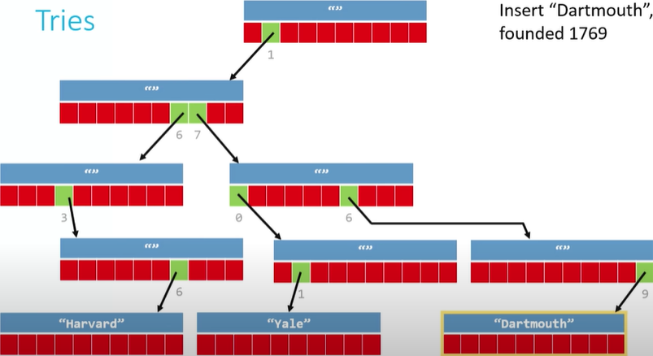

 # Shorts week 5: Tries.

 * Added to our previous known data structures that handle the mapping of key-value pairs:

    * Arrays: Where the key is the element index, the value is the data at that location.
    * Hash tables: The key is the hash code of data, the value linked list of data hashing to that hash code.
<br>
<br>
* This new, and slightly different data structure, the key is guaranteed to be unique, and the value could be as simple as a boolean that tells you whether, the data exists in the structure.

## Starting with tries.

* Let´s map key-value pairs where the keys are four-digit years (YYYY) and the values are names of universities founded during those years.

* In a trie, the paths from a central **root** node to a **leaf** node (where the school names would be), would be labeled with digits of the year. (look at it as a normal tree but upside down, where the root is at the top and each branch has 10 nodes)

* Each node on the path from root to leaf could have 10 pointers emanating from it, one from each digit.

## Creating a trie.

```c
typedef struct_trie
{
    char university[20];
    stryct_trie* paths[10];   
}
trie;
```
- Here, we first define a new data structure called a trie, inside there are 2 pieces, the name of the university and an array of pointers to other nodes of the same type, with 10 different places that we can go.

## Insert into a a trie.

Starting at our root, the follow nodes must be null, and once we are sure that they are nulls, we weill be able to allocate dynamically the next node



- once we allocated the nodes and we need to store more info, it could just start at the root, and create a pathway to the element we want to store.

## Search into a trie.

* Using successive digits of the key, we can navigate from the root, and if you can make it to the end without hitting a dead end (a NULL pointer), you´ve found it.


* We would rather to use a function that traverse the entire path and checks if the node exists, if thats what im loking for until we reach the dead end.