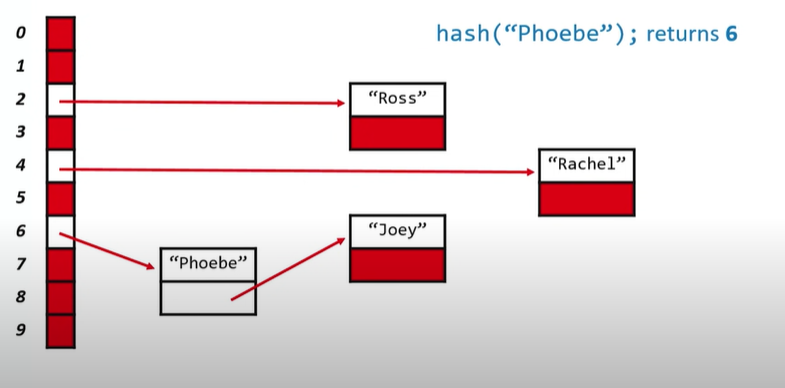

# Shorts5 
## Hash Tables.

* Hash tables combine the random access ability of an array with the dynamism of a linked list.

* This means(assuming we define our hash table well):
    * Insertion can start to tend toward *O(1)*
    * Deletion can start to tend toward *O(1)*
    * Lookup can start to tend toward *O(1)*
    
    *all of them on constant time*

* Also provides a easier way to grow and shrink

* When we insert data into our new structure, the data itself gives us a clue about where we will find the data.

* The disadvantage is that  hash tables are not great at ordering or storing data, if you use for this the **running time** Becomes closer to *O(n)*.(like a linked list).

## What they are?

* A hash table amounts to a combination of **two** things, a **hash function**, which returns an nonnegative integer value called a *hash code*. Secondly, an **array** capable of storing data of the type we wish to place into the data structure.

* The idea is that we run our data through the hash function, and then store the data in the element of the array represented by tge returned hash code.


## Defining a hash function.

* A good hash function should:
    1. Use Only the data being hashed.
    1. Use all of the data being hashed.
    1. Be deterministic. (Each time we pass the exact same piece of data into the hash function we always get the same hash code out).
    1. Uniformly distribute data.
    1. Generate very different harsh codes for very similar data.

```c
    unsigned int hash(char* str)
    {
        int sum = 0;
        for (int j =0; str[j] != '\0'; j++)
        {
            sum += str[j];
        }
        return sum % HASH_MAX;
    }
```
- This is an *starlen* implementation, basically all this function is adding up all the ASCII values of my string, and then its returning a **hash code** moded by *HASH_MAX* which it´s probably the size of my array (or *str*ing).


## Collision.

* What if the **hash code** got after process the function is already in use by other?, having the same **hash code** for two different elements is called a **Collision**, when two pieces of data yield the same hash code.

* We shouldn´t simply overwrite the data that happened to be placed in there first, since we want to store *both* pieces of data in the hash table.

* In order to get both elements into the hash table, while trying to preserve quick insertion and lookup, lets take a look of a couple of ways to solve this.

## Resolving collisions: Linear probing.

* In this method, if we have a collision, we try to place the data in the next consecutive element in the array (Wrapping around to the beginning if necessary) until we find a vacancy.

* If we don´t fin what we´re looking for in the first location, at least, hopefully the element is somewhere nearby.

* The problem of having to assign other hash codes to allocate elements nearby, is called **clustering**. Once there´s a miss, two adjacent cells will contain data, making it more likely in the future that the cluster will grow.(since we could still get the old hash code when run another element trough our hash function, making our cluster to grow by 1, and keep growing and growing)

* Even if we switch to another probing technique, we´re still limited. We can only store as much data as we have locations in our array.

## Resolving collisions: Chaining.

* What if instead of each element of the array holding just one piece of data, it held multiple pieces of data?

* If each element of the array is a pointer to the head of a linked list, then multiple pieces of data can yield the same hash code and we´ll be able to store it all!, by doing it, we´ve **eliminated clustering**.

* From experience with linked lists that insertion (and creation, if necessary) into a linked list in an **O(1)** operation

* For lookup, we only need to search through what is hopefully a small list, since we,re distributing what would otherwise be one huge list across *n* lists



*image12* look how Phoebe is added by making her point to Joey and then sixth to Phoebe.


